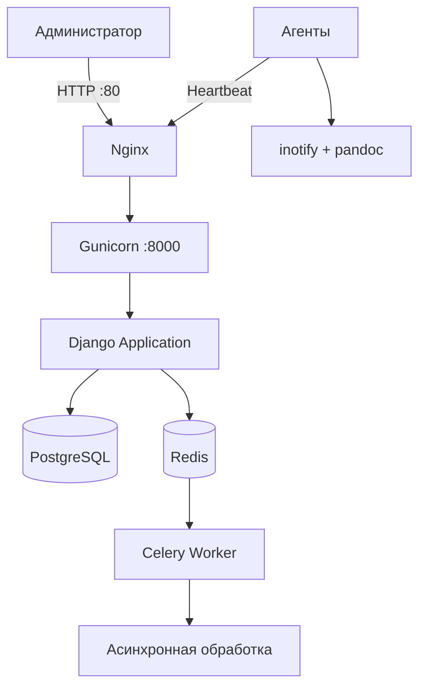

Вот готовый Markdown‑код для `README.md`. Скопируйте его полностью и вставьте в редактор файла на GitHub (нажмите на карандаш в правом верхнем углу страницы репозитория).

```markdown
<p align="center">
  
</p>

<h1 align="center">🛡️ Astra File Monitor (AFM)</h1>

<p align="center">
  <em>Централизованный полнотекстовый поиск и автоматическое выявление конфиденциальных данных на управляемых машинах</em>
</p>

<p align="center">
  <a href="#ключевые-возможности">Возможности</a> •
  <a href="#быстрый-старт">Быстрый старт</a> •
  <a href="#установка-агентов">Установка агентов</a> •
  <a href="#смена-ip-адреса">Смена IP</a> •
  <a href="#архитектура">Архитектура</a> •
  <a href="#api-агента">API агента</a> •
  <a href="#обновление">Обновление</a>
</p>

---

## 🔥 Ключевые возможности

| Возможность | Описание |
|-------------|----------|
| 🔍 **Полнотекстовый поиск** | Русская морфология, гибкие фильтры (владелец, расширение, размер, дата) |
| 🛡️ **Детектирование триггеров** | Автоматический поиск заданных ключевых слов в файлах |
| 📊 **Интерактивные дашборды** | Графики инцидентов, типов файлов, доступности агентов |
| 🤖 **Умные агенты** | Реактивный мониторинг (inotify), плагины, автообновление, REST API |
| 🌓 **Тёмная / светлая тема** | Переключается на лету, сохраняется в браузере |
| 📦 **Развёртывание одной командой** | `sudo bash deploy.sh` — и всё готово |
| 📄 **Экспорт отчётов** | PDF и CSV |
| 🛑 **Защита от брутфорса** | Блокировка после 5 неудачных попыток входа |
| 📈 **Мониторинг Celery** | Flower на порту 5555 |

## ⚙️ Требования

### Сервер
- ОС: Debian 11/12, Ubuntu 20.04/22.04/24.04 или Astra Linux SE 1.7
- root‑доступ
- Порт 80 (HTTP) должен быть открыт
- Минимальные ресурсы: 2 vCPU, 4 ГБ RAM, 20 ГБ HDD/SSD

### Агенты
- Debian/Ubuntu/Astra Linux ARM (рабочие станции)
- Python 3, доступ к серверу AFM (порт 80)

## 🚀 Быстрый старт (сервер)

```bash
git clone https://github.com/Fedoroff00/afm-server.git
cd afm-server
sudo bash deploy.sh
```

Скрипт автоматически:
- установит Docker и Docker Compose (если ещё не установлены)
- определит ваш IP‑адрес и сгенерирует надёжные пароли
- запустит все контейнеры (PostgreSQL, Redis, веб‑сервер, Celery)
- предложит создать учётную запись администратора

После завершения откройте в браузере `http://<ваш‑IP>` и войдите с указанными учётными данными.

## 🖥️ Установка агентов на контролируемые машины

1. В веб‑интерфейсе перейдите в раздел **«Машины» → «Добавить агента»**.
2. Укажите хостнейм и IP‑адрес целевой машины, нажмите **«Создать агента»**.
3. Скопируйте появившуюся команду и выполните её **на целевой машине**:

```bash
wget http://<IP-сервера>/media/packages/astra-monitor-agent_latest_all.deb && \
echo 'astra-monitor astra-monitor/server_url string http://<IP-сервера>' | sudo debconf-set-selections && \
echo 'astra-monitor astra-monitor/token string ВАШ_ТОКЕН' | sudo debconf-set-selections && \
sudo dpkg -i astra-monitor-agent_latest_all.deb
```

Агент установится, запустится и начнёт сканировать `/home`, отправляя результаты на сервер.

> 💡 **Совет:** для массовой установки используйте Ansible или аналогичные системы управления конфигурациями.

### Как работает агент

- **Реактивный мониторинг** – `inotify` отслеживает создание/изменение файлов в реальном времени.
- **Периодическое полное сканирование** – раз в час (по умолчанию) проверяет все заданные директории.
- **Извлечение текста** – поддерживает `.txt`, `.log`, `.md` и др., а также `.odt`, `.docx`, `.rtf`, `.pdf` через `pandoc`.
- **Heartbeat** – каждые 5 минут отправляет серверу запрос, получает обновлённую конфигурацию и список триггеров.
- **Локальная очередь** – при недоступности сервера файлы сохраняются и отправляются после восстановления связи.
- **REST API** – встроенный HTTP‑сервер на порту 9090 для мониторинга и управления.
- **Плагины** – можно добавлять собственные обработчики событий в `/opt/astra-monitor/plugins`.

## 🔄 Смена IP‑адреса сервера

Если сервер был перенесён в другую сеть или изменился его IP‑адрес, выполните в папке проекта:

```bash
sudo bash change_ip.sh
```

Скрипт обновит конфигурацию и перезапустит контейнеры.  
Не забудьте после этого обновить `server_url` в файле `/etc/astra-monitor/config.yaml` на агентах и перезапустить их:

```bash
sudo systemctl restart astra-monitor
```

## 🏗️ Архитектура



Серверная часть построена на Docker Compose и включает:
- **веб‑сервер** (Gunicorn + Django) – 2 экземпляра, балансировка через nginx
- **PostgreSQL 15** с полнотекстовыми индексами
- **Redis 7** – брокер Celery и кэш сессий
- **Celery worker + beat** – асинхронная обработка файлов и периодические задачи
- **Flower** – мониторинг очередей Celery (порт 5555)
- **nginx** – обратный прокси и раздача статики

Для высокой нагрузки можно увеличить количество контейнеров:
```bash
docker compose up -d --scale web=4 --scale celery_worker=4
```

## 📡 API агента (порт 9090)

Каждый установленный агент предоставляет HTTP‑API для прямого управления и мониторинга:

| Метод | Эндпоинт | Описание |
|-------|----------|----------|
| `GET` | `/metrics` | Метрики агента (количество просканированных файлов) |
| `GET` | `/status` | Состояние агента в JSON (известные файлы, очередь повторов, триггеры, конфигурация) |
| `POST` | `/scan` | Запустить немедленное полное сканирование |
| `GET` | `/file?path=<путь>` | Скачать оригинальный файл с машины |

## 🔄 Обновление

### Серверная часть
```bash
cd afm-server
git pull
sudo bash deploy.sh
```

### Агенты
- Массовое обновление через веб‑интерфейс: выберите агентов и нажмите **«Обновить выбранных»**.
- Агент автоматически скачает и установит новый deb‑пакет с сервера, затем перезапустится.

## 🆘 Поддержка

Сообщить о проблеме или предложить улучшение можно через [GitHub Issues](https://github.com/Fedoroff00/afm-server/issues).

---

<p align="center">
  <sub>Лицензия MIT | Версия 2.1.0</sub>
</p>
```

После вставки нажмите **Commit changes** – страница репозитория станет красивой и структурированной.
